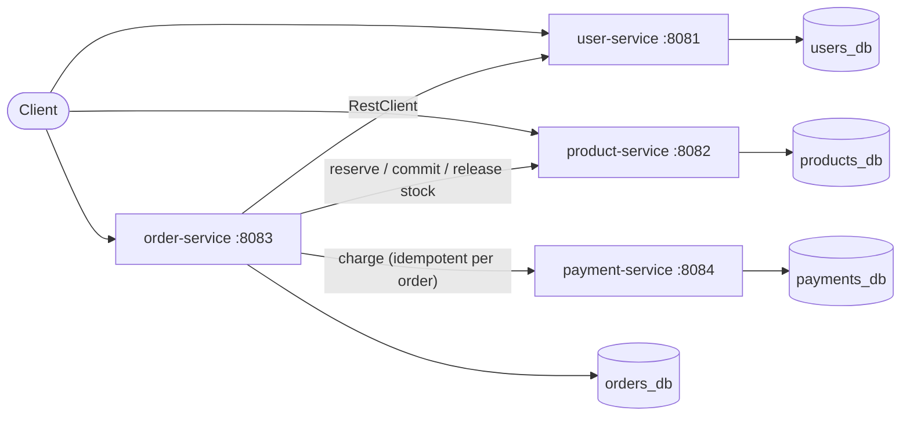

# E-Commerce Microservices: Resilient Checkout

[](https://github.com/Lokesh-290104/ecommerce-microservices/actions/workflows/ci.yml)


Four Spring Boot microservices (users, products, orders, payments), each with its own MySQL
schema, designed so that **checkout survives a payment-service outage**: no lost orders, no
leaked stock and no double charges. Every behaviour is covered by tests that run against a real
MySQL, both locally and in CI.

## Architecture



One MySQL 8.4 container holds four schemas. Each service logs in as its own MySQL user that is
granted only its own schema, so a cross-service join is refused by the database itself.

## Status

- [x] Four services, Docker Compose stack with health-gated startup, one-command build
- [x] Users API: registration with BCrypt, unique email, paging, soft delete
- [x] Catalog API: products with separate inventory rows, optimistic locking (409 on stale edits)
- [x] Flyway migrations, RFC 7807 problem responses, request validation
- [x] Integration tests on real MySQL (Testcontainers) + GitHub Actions CI
- [ ] Inventory reservations (atomic, idempotent, concurrency-tested)
- [ ] Payments with one-payment-per-order idempotency
- [ ] Checkout saga: idempotency keys, circuit breakers and timeouts (Resilience4j), and a
      reconciler that settles orders after an outage
- [ ] JWT authentication and service-to-service tokens
- [ ] Measured query optimization (k6 + SQL counts)

The full design, with the reasoning behind every decision (D10-D27), is in
[docs/designs/resilient-checkout-microservices.md](docs/designs/resilient-checkout-microservices.md).

## Engineering highlights

- **Database-per-service enforced, not just agreed:** per-service MySQL users with
  schema-scoped grants; root is limited to `localhost`. A test proves each user is refused on
  the other schemas.
- **Stock separate from catalog:** `inventory` lives beside `products`, so catalog edits
  (optimistic `@Version`) never conflict with stock changes; `available = on_hand - reserved`,
  guarded by a database CHECK constraint.
- **Honest health checks:** MySQL reports healthy only after its init script has finished,
  because the check logs in as the last user the script creates (`mysqladmin ping` passes even
  on access denied). A bad password fails setup loudly instead of producing a MySQL with no users.
- **Consistent errors:** every error is an RFC 7807 `application/problem+json` body with a
  machine-readable `code`; validation errors list each bad field.
- **Tests that match production:** integration tests start MySQL 8.4 with the same init script
  as Compose; config tests pin ports, jar names and passwords across Compose, Dockerfiles and
  application config so they cannot drift.

## Try it in 60 seconds

```bash
scripts/build.sh && docker compose up -d --wait      # build jars + images, start everything

curl -s -X POST localhost:8081/api/users -H 'Content-Type: application/json'   -d '{"email":"ada@example.com","password":"correct-horse","name":"Ada"}'

curl -s -X POST localhost:8082/api/products -H 'Content-Type: application/json'   -d '{"categoryId":1,"name":"Headphones","price":199.99,"initialStock":25}'

curl -s 'localhost:8082/api/products?categoryId=1&size=5'
```

| Service | Port | Schema |
|---|---|---|
| user-service | 8081 | `users_db` |
| product-service | 8082 | `products_db` |
| order-service | 8083 | `orders_db` |
| payment-service | 8084 | `payments_db` |

## Run locally

Requires JDK 21 (`JAVA_HOME`) and Docker with Compose v2. On Windows the JDK can be on
Windows and Docker inside WSL; `scripts/build.sh` handles both.

```bash
scripts/build.sh          # ./mvnw package (runs tests), then docker compose build
docker compose up -d --wait
curl localhost:8081/actuator/health
```

On Windows with Docker in WSL, run the compose commands inside WSL, e.g. from Git Bash:
`wsl.exe --cd "$(pwd -W)" docker compose up -d --wait`.

MySQL is published on `127.0.0.1:3307` (override with `MYSQL_HOST_PORT`). Local dev
passwords live in `.env.example`; copy it to `.env` to change them. Passwords are set only
when the MySQL volume is first created, so after changing one run `docker compose down -v`
(otherwise MySQL stays unhealthy and no service starts). A password must not contain `'`
or `\`, and a literal `$` is written as `$$`.

## API

| Service | Endpoint | Notes |
|---|---|---|
| user | `POST /api/users` | Register; password stored as a BCrypt hash; duplicate email (any case) -> 409 |
| user | `GET /api/users/{id}` | 404 ProblemDetail if missing or deleted |
| user | `GET /api/users?page&size` | Paged, sorted by id, size <= 100 |
| user | `PUT /api/users/{id}` | Change email and name |
| user | `DELETE /api/users/{id}` | Soft delete (`active=false`); the email stays taken |
| product | `POST /api/products` | Creates the product and its inventory row in one transaction |
| product | `GET /api/products/{id}` | `available = on_hand - reserved` |
| product | `GET /api/products?categoryId&page&size` | Paged, sorted by id |
| product | `PUT /api/products/{id}` | Catalog fields only; send the `version` you read, stale -> 409 |

Errors are RFC 7807 `application/problem+json` bodies with a machine-readable `code`
(e.g. `EMAIL_TAKEN`, `VERSION_CONFLICT`) and, for validation, a per-field `errors` list.
Schemas are created by Flyway migrations; Hibernate only validates them.

## Tests

`./mvnw verify` runs the unit tests (offline) and then the `*IT` integration tests, which
start a real MySQL 8.4 with [Testcontainers](https://testcontainers.com/) using the same init
script as compose. Without a reachable Docker daemon the integration tests are skipped, not
failed. CI runs everything on every push and pull request.

### Testcontainers on Windows with Docker in WSL

The JVM runs on Windows but Docker lives in WSL, so the WSL daemon also listens on a TCP port
bound to loopback only. In WSL:

```bash
sudo mkdir -p /etc/systemd/system/docker.service.d
printf '[Service]\nExecStart=\nExecStart=/usr/bin/dockerd -H fd:// -H tcp://127.0.0.1:2375 --containerd=/run/containerd/containerd.sock\n' \
  | sudo tee /etc/systemd/system/docker.service.d/override.conf
sudo systemctl daemon-reload && sudo systemctl restart docker
```

Then on Windows: `setx DOCKER_HOST tcp://localhost:2375` and open a new terminal.

> **Security:** this TCP socket has no authentication and is root-equivalent inside WSL.
> It is bound to `127.0.0.1` only, so nothing outside your machine can reach it, but any
> local process can. Never bind it to `0.0.0.0`. Keep WSL running during test runs (WSL
> shuts an idle VM down; `vmIdleTimeout` in `.wslconfig` controls that).

Release notes are in [CHANGELOG.md](CHANGELOG.md); deferred work is in [TODOS.md](TODOS.md).
